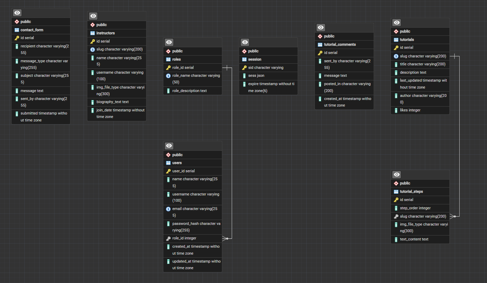

# cse340-final-schmitz

# Description:
Final project for CSE340 - educational platform about knitting or crocheting
For anyone who wants to learn how to knit or crochet and for those who want to share their skills

# Database Schema:

# User Roles:
Admin: create, view, update, and delete any site data, full access to database, view, update, and delete any user except themselves
Instructor: create, view, edit, and delete tutorials THEY create, view and respond to contact forms addressed to them, submit a comment on a tutorial, submit contact forms, view and update their own user profile, view instructor page and edit their own bio
User: view site tutorials and submit comments, submit contact form or application to be instructor, view and edit their own profile, view instructor page

# Test Account Credentials (all passwords are the one required in the project requirement document):
(Role: Name, email to login with)
Admin: Ava Grace, admin@example.com
Instructor: Emily Johnson, instructor@example.com
User: Molly Weaver, user@example.com

# Known Limitations
- Did not get to implement dark mode
- At the time of submission for the assignment not all role features have been implemented but that should change before the meeting